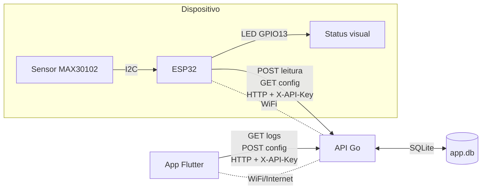

# Monitor Cardíaco IoT — ESP32 + Go + Flutter

Sistema embarcado ponta-a-ponta: um **ESP32** com sensor **MAX30102** mede
batimentos (BPM) e SpO2, classifica cada leitura e envia para uma **API em Go**,
que persiste em **SQLite**. Um app **Flutter** mostra o histórico em tempo real e
ajusta, ao vivo, o limiar de alerta que o dispositivo passa a respeitar.

> Projeto de Sistemas Embarcados — hardware, firmware, backend e app, cada um
> na sua stack, integrados por uma API HTTP simples.

## Arquitetura



- O ESP32 faz **POST** de cada leitura em `/api/v1/logging` e consulta
  **GET** `/api/v1/controle` periodicamente — então mudar o limiar no app reflete
  no dispositivo em segundos.
- O LED do dispositivo codifica o estado (aceso = lendo, pisca devagar = normal,
  pisca rápido = leitura inconsistente, 2 piscadas + pausa = alerta), então dá pra
  ler o estado sem tela.

## Stack

| Camada | Tecnologia |
|--------|-----------|
| Firmware | C++ / Arduino (PlatformIO), ESP32, MAX30102 |
| Backend | Go (stdlib `net/http`), SQLite via `modernc.org/sqlite` (Go puro, sem CGO) |
| App | Flutter (Dart) — Android, iOS e Web |
| Infra | Docker multi-stage, Docker Compose, Fly.io |

Decisões de projeto: SQLite embarcado (zero serviço externo pra uma demo),
driver Go puro (binário estático, imagem Docker mínima), config injetada por
ambiente (nada de segredo hardcoded), auth por API key comparada em tempo
constante.

## Estrutura

```
proj/
├── backend/        API Go + SQLite + Dockerfile + fly.toml
├── app/            App Flutter (frontend oficial / deploy)
├── firmware/       Firmware ESP32 (PlatformIO)
└── _exploracoes/   Mesmo frontend em React, Scala.js e HTML puro (referência)
docker-compose.yml  Sobe o backend com volume persistente
scripts/build_web.sh  Build do Flutter Web com URL/chave via --dart-define
```

## Como rodar

### 1. Backend (Docker)

```bash
docker compose up --build
# API em http://localhost:8080 — cheque: curl http://localhost:8080/healthz
```

Ou local, sem Docker: `cd proj/backend && go run .` (banco em `./app.db`).

### 2. Firmware (ESP32)

```bash
cd proj/firmware
cp src/secrets.example.h src/secrets.h   # preencha WiFi, IP do backend e API key
pio run --target upload                  # compila e grava no ESP32
pio device monitor                       # acompanha as leituras na serial
```

### 3. App (Flutter)

```bash
cd proj/app
flutter pub get
flutter run --dart-define=API_BASE_URL=http://SEU_IP:8080 --dart-define=API_KEY=zica123
```

## API

Todas as rotas (exceto `/healthz`) exigem o header `X-API-Key`.

| Método | Rota | Descrição |
|--------|------|-----------|
| `GET` | `/healthz` | Liveness (sem auth) |
| `POST` | `/api/v1/logging` | Registra uma leitura `{bpm, spo2, class, user_id}` |
| `GET` | `/api/v1/logging` | Últimas 50 leituras |
| `DELETE` | `/api/v1/logging` | Limpa o histórico |
| `GET` | `/api/v1/controle` | Config atual `{bpm_threshold, alert_enabled}` |
| `POST` | `/api/v1/controle` | Atualiza a config |

## Deploy

- **Backend** → Fly.io (`proj/backend/fly.toml`): imagem Docker, volume
  persistente pro SQLite e HTTPS automático. `API_KEY` e `ALLOWED_ORIGIN` vão
  como *secrets*, não no código.
- **App Flutter Web** → estático (GitHub Pages / Netlify): `./scripts/build_web.sh`
  injeta a URL do backend e a chave no build.

Atenção: com o app Web em HTTPS, o backend **também** precisa de HTTPS (senão o
navegador bloqueia por mixed-content) — por isso o deploy no Fly com TLS.

## Testes

```bash
cd proj/backend && go test ./...   # fluxos de logging, config e auth
```

## Próximos passos

- Classificação com **TinyML** de verdade no dispositivo (hoje é regra fixa por limiar).
- SpO2 com precisão clínica (a estimativa atual é aproximada).
- Filtro por usuário (RFID) no histórico do app.

## Segurança

A API key é uma proteção **simbólica** de demonstração: em qualquer cliente
(app/web) ela chega ao usuário final. Para exposição pública real, o backend
precisaria de auth por dispositivo, rate limiting e a chave trocada por uma forte
via ambiente. Credenciais de WiFi e chave de API ficam em arquivos locais
(`secrets.h`, `.env`) fora do versionamento.
